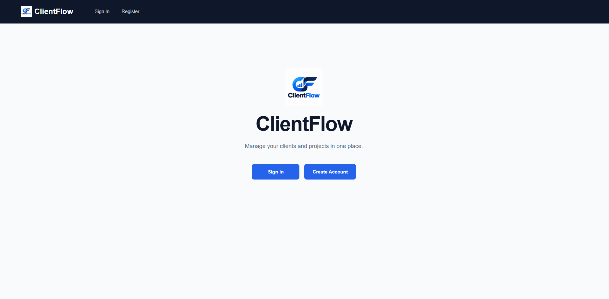
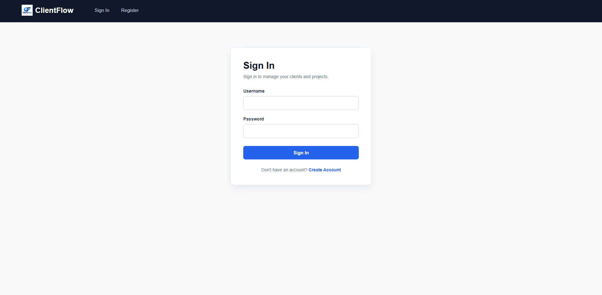
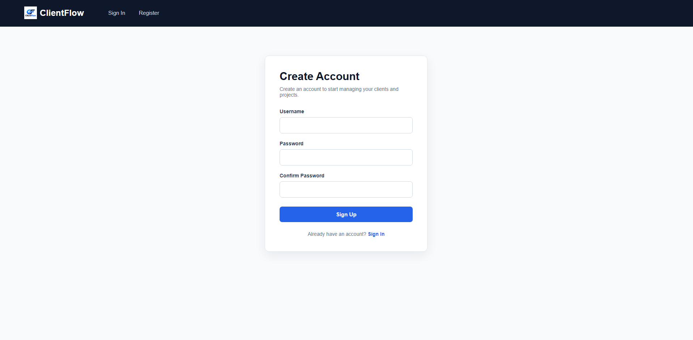
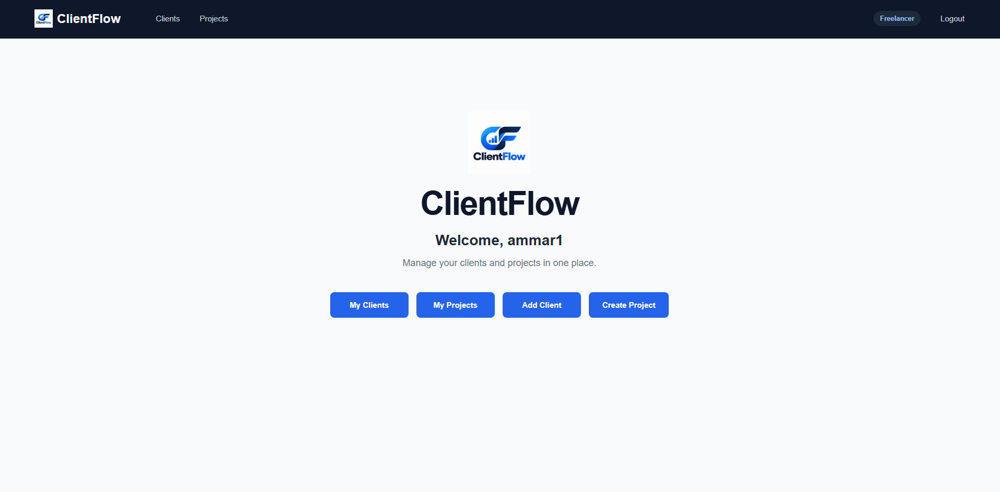
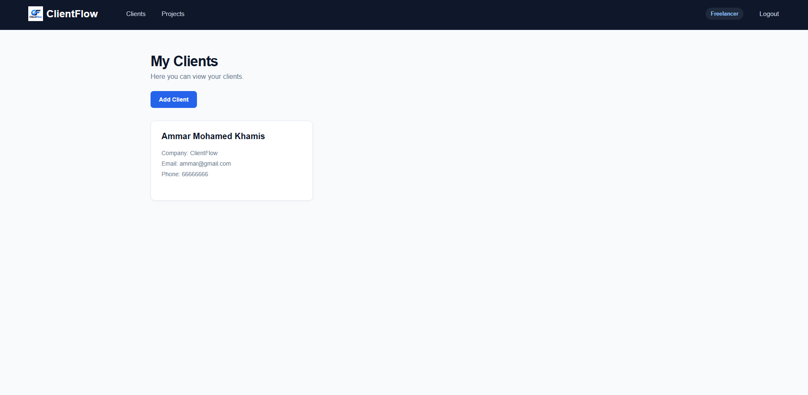
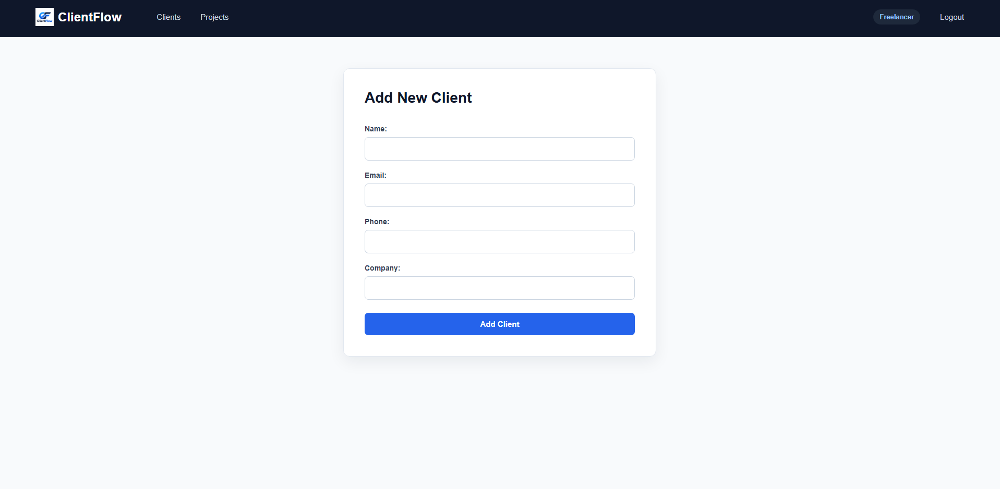
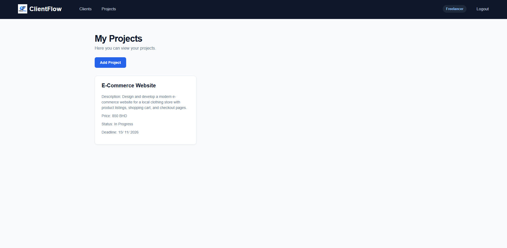
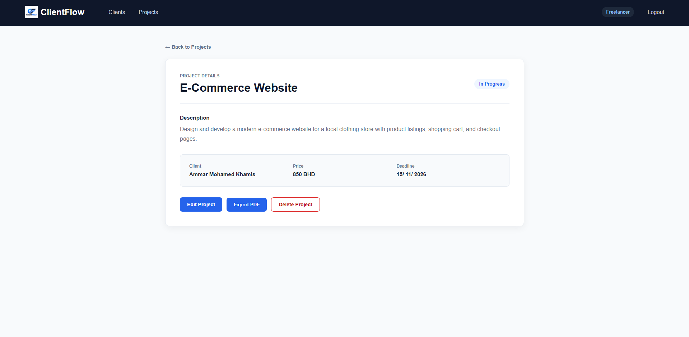
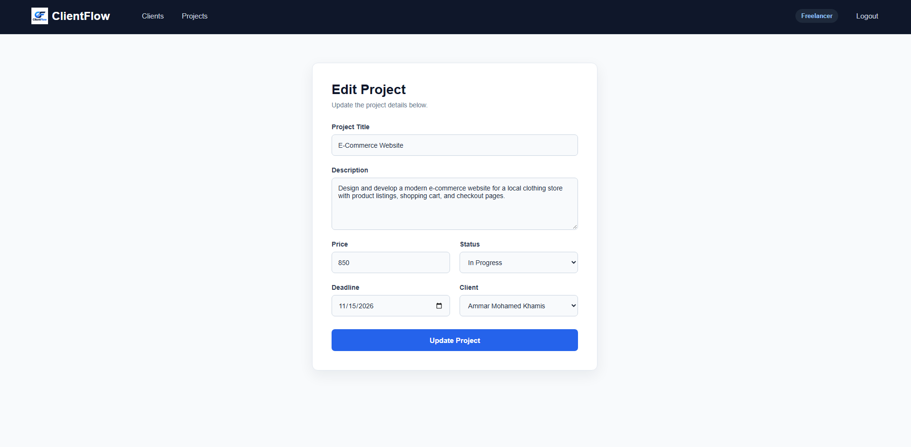

# ClientFlow – Freelancer CRM

## Overview

ClientFlow is a freelancer CRM application designed to help freelancers manage their clients and projects in one place.

The application allows users to create an account, securely sign in, add and view clients, and create projects linked to their clients. Each project includes important information such as the title, description, price, status, and deadline.

Users can view, update, and delete their own projects, track project progress, and export project details as a PDF. ClientFlow also uses authentication and authorization to ensure users can only access and manage their own data.
## Screenshots

### Home Page


### Sign In Page


### Sign Up Page


### Dashboard


### Clients Page


### Add Client Page


### Projects Page


### Project Details Page


### Update Project Page



## Technologies Used
- JavaScript
- Node.js
- Express.js
- MongoDB
- Mongoose
- EJS
- CSS
- bcrypt
- express-session
- method-override

## Getting Started

To run ClientFlow locally:

1. Clone the repository:

```bash
git clone https://github.com/Akhamis1/project-2-client-flow.git
```

2. Go into the project folder:

```bash
cd project-2-client-flow
```

3. Install the dependencies:

```bash
npm install
```

4. Create a `.env` file in the root of the project.

5. Add the following variables to the `.env` file:

```env
MONGODB_URI=your_mongodb_connection_string
SESSION_SECRET=your_session_secret
PORT=3000
```

6. Start the application:

```bash
npm start
```

7. Open your browser and go to:

```text
http://localhost:3000
```

8. Create an account and sign in to start using ClientFlow.

## User Stories

- As a user, I want to create an account and login.
- As a user, I want to add my clients.
- As a user, I want to see my clients.
- As a user, I want to create projects for my clients.
- As a user, I want to see all my projects.
- As a user, I want to see the details of a project.
- As a user, I want to edit my projects.
- As a user, I want to delete my projects.
- As a user, I want to logout from my account.

## Database Design


## Routes

### Home Route

| Method | Route | Description |
|--------|-------|-------------|
| GET | `/` | Display the home page |

### Authentication Routes

| Method | Route | Description |
|--------|-------|-------------|
| GET | `/auth/sign-up` | Display the sign-up form |
| POST | `/auth/sign-up` | Create a new user account |
| GET | `/auth/sign-in` | Display the sign-in form |
| POST | `/auth/sign-in` | Sign in a user |
| GET | `/auth/sign-out` | Sign out the current user |

### Client Routes

| Method | Route | Description |
|--------|-------|-------------|
| GET | `/clients` | Display the signed-in user's clients |
| GET | `/clients/new` | Display the new-client form |
| POST | `/clients` | Create a new client |

### Project Routes

| Method | Route | Description |
|--------|-------|-------------|
| GET | `/projects` | Display the signed-in user's projects |
| GET | `/projects/new` | Display the new-project form |
| POST | `/projects` | Create a new project |
| GET | `/projects/:projectId` | Display one project |
| GET | `/projects/:projectId/edit` | Display the project edit form |
| PUT | `/projects/:projectId` | Update a project |
| DELETE | `/projects/:projectId` | Soft-delete a project |


## Features
- User registration and login
- Session-based authentication
- Add and view clients
- Create projects for clients
- View project details
- Edit projects
- Delete projects
- Project ownership and authorization
- Project status tracking
- Project deadlines
- Export project details as PDF
- ClientFlow logo and navigation

## Future Enhancements
- Edit and delete clients
- Search for clients and projects
- Filter projects by status
- Project dashboard statistics
- Add invoices to projects
- Add payment tracking

## Credits
- Developed by Ammar Mohamed Khamis.
- Built as part of the General Assembly Software Engineering Bootcamp.
- Authentication structure was based on the course MEN Stack authentication template.
- ClientFlow logo was created using OpenAI image generation.